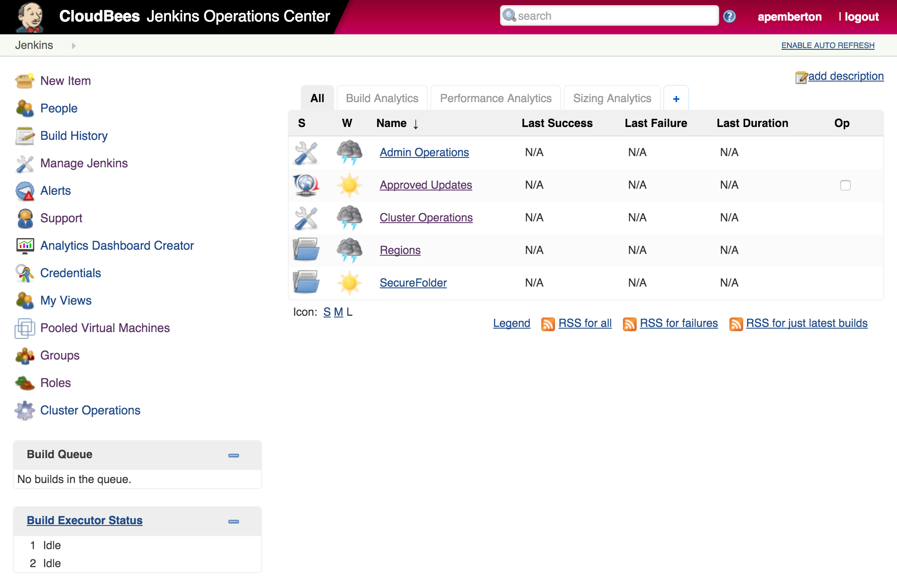
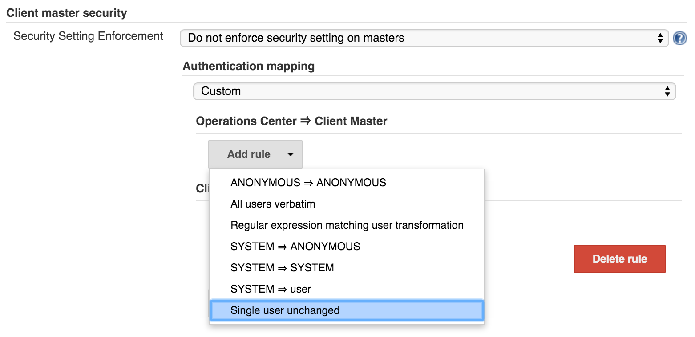
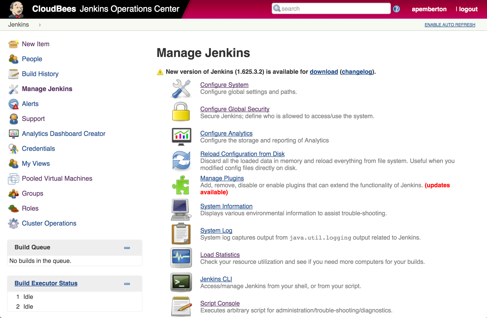
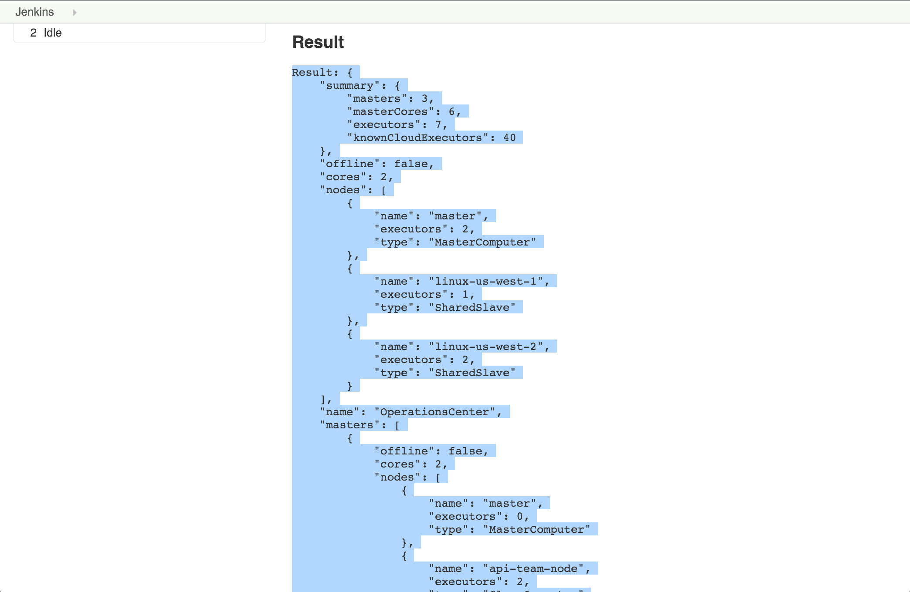

# Handy Groovy Scripts for Jenkins and CloudBees Jenkins Platform

The scripts in this repository can be run in Jenkins script console: Manage Jenkins > Script Console. Most work on any Jenkins Enterprise instance, while some are specific to CloudBees Jenkins Operations Center (CJOC).

## Count CJOC JSON

The Count CJOC JSON script runs on CJOC's script console. The script captures the executor, cloud, and CPU core count attached to the platform. The script script dynamically creates a Cluster Operation and executes the operation across all Client Masters connected to CJOC.

NOTE: The master branch version of the `count-cjoc-json.groovy` script is for the 1.7.1+ version of the Operations Center Cluster Operations Plugin. If you are on an older version (1.7.0-) then please use the 1.7.0 branch version of the script [here](https://github.com/cloudbees/jenkins-scripts/blob/1.7.0/count-cjoc-json.groovy).

**Running the script**

1.    Log into CloudBees Jenkins Operations Center (CJOC)
    

    Note: if you *do not* have CJOC's SSO Feature enabled (configured at: Manage Jenkins > Configure Global Security > Client master security, i.e.: if the setting is "Do not enforce security setting on masters"), you need to ensure the user logging into CJOC also has permissions to execute scripts on the Client Masters. Assuming your CJOC and Client Masters use the same Security Realm and thus a user exists between them with the appropriate permissions, the most straight forward way to do so is to add an Authentication Mapping for the username with those permissions:
    

  * You will need to restart CJOC after making the changes.

2.    Click 'Manage Jenkins' on the left-hand panel, followed by the 'Script Console' link
    

3.    Copy + Paste [the script](https://github.com/cloudbees/jenkins-scripts/blob/master/count-cjoc-json.groovy) into the console window and click the Run button
    

4.    Copy + Paste the output into a file and send it to the CloudBees team
    
